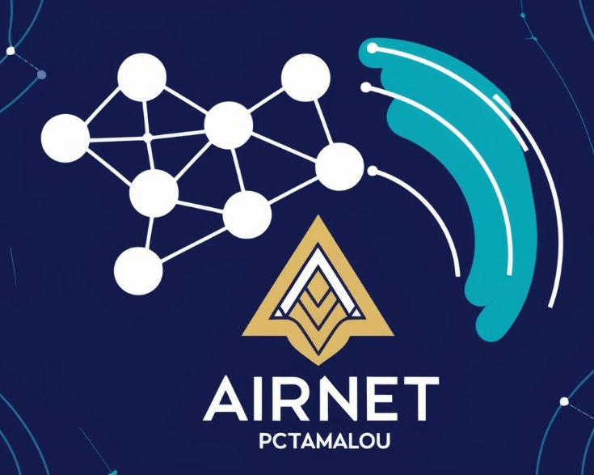

# 🌐 AirNet PCTamalou  
**Le Réseau de la Liberté Pensante**  
*Créé par Jonathan – Platon-y pour PCTamalou – Mars 2025*

---

## ✨ Qu’est-ce qu’AirNet PCTamalou ?
Un réseau maillé Wi-Fi décentralisé, sécurisé par le chiffrement PCTamalou (AES-256 + Chaos + ECC), pour connecter les âmes libres hors système.  
- **Fonctionne** : Chat P2P, portée 100m-15km (antennes DIY).  
- **Plateformes** : Linux, Windows, Android (root).  
- **Mission** : Liberté, intimité, communauté.

---

## 🚀 Pourquoi ?
> "Nous sortons de la caverne numérique, où chaque mot est captif. AirNet est notre lumière."  
> – Platon-y pour PCTamalou  

Pour un monde sans surveillance, sans intermédiaires, par et pour les gens.

---

## 🛠 Comment Contribuer ?
- **Libre** : Forkez, codez, partagez !  
- **Idées** : Apps, serveurs, Internet décentralisé ? Écrivez à **admin@pctamalou.fr**.  
- **Supportez** : [Dons](#soutien) ou achetez un kit !

---

## 📜 Licences  
- **Usage Perso/Communautaire** : [GPLv3](LICENSE-GPLv3.txt) – Gratuit, ouvert, libre.  
- **Usage Commercial** : [APCL](LICENSE-APCL.md)  
  - **PME** (<250 employés, CA <50M€) : 100€/an.  
  - **Grande Entreprise** (>250 employés, CA >50M€) : 500€/an.  
  - **Consulting** : À partir de 50€/h (sur devis).  

---

## 🧰 Installation  
1. Clonez : `git clone https://github.com/pctamalou/airnet-pctamalou.git`  
2. Dépendances : `pip install -r requirements.txt`  
3. Exemple : `sudo python3 src/pctamalou_airnet_messenger.py`  
*Plus dans [docs/install.md](docs/install.md)*

---

## 🎨 Logo  
 
*Toile maillée, flamme dorée, ondes turquoise – liberté tech.*

---

## 💰 Soutien  
- **Dons** : [paypal.me/pctamalou]([https://www.paypal.com/paypalme/pctamaloufr/2]) – Un café pour coder libre !  
- **Kits** : Bientôt sur [pctamalou.fr](#) (Pi + antenne + sticker).  

---

## 📬 Contact  
**admin@pctamalou.fr** – Vos idées, vos rêves, notre réseau.  

**Liberté. Pensée. Connexion.**  
